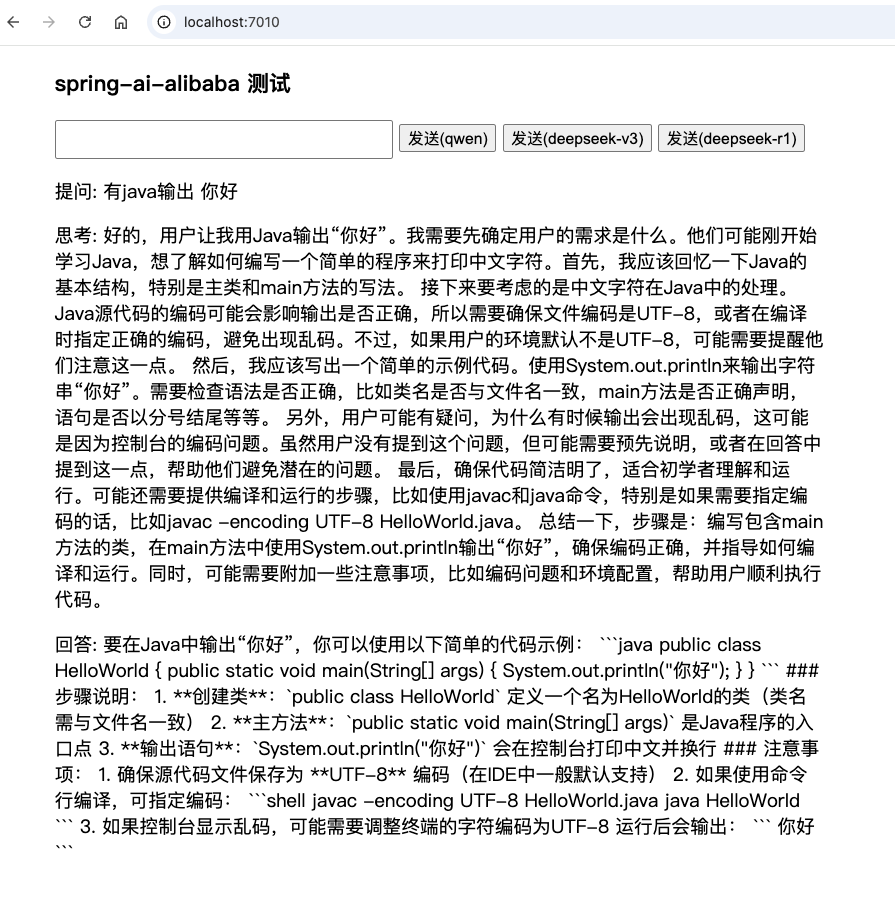

## spring-ai-alibaba-demo

使用 spring-ai-alibaba 框架对接 DeepSeek  DashScope(通义千问) 等大模型,提供了简易的对话页面.

#### 技术:

1. springBoot 3.4
2. spring-ai-alibaba
3. java 21 

● spring-ai GitHub仓库：https://github.com/spring-projects/spring-ai

● spring-ai 官方文档：   https://spring.io/projects/spring-ai

#### 部署

在 application.yml 中, 替换 ai.dashscope-api-key 为你的api-key.

在 阿里云百炼 平台 https://bailian.console.aliyun.com/, 获取api-key.

本地启动
浏览器访问:http://localhost:7010, 进入对话页面,开始你与AI的对话之旅吧....

